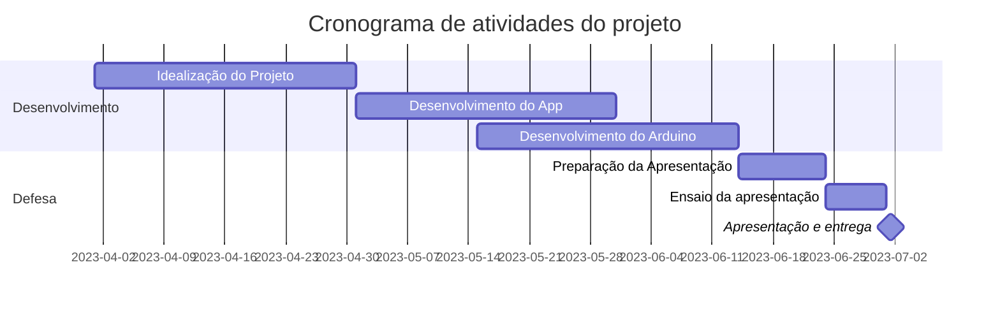

# Plant-Care-Projeto-Integrador
Projeto para a disciplina de Projeto Integrador 2

A ideia é criar um aplicativo de celular que se comunique com um sensor de umidade instalado no solo de uma planta doméstica.
O objetivo é analisar e criar uma rotina de cuidados com as plantas 

# Diagrama Gantt

