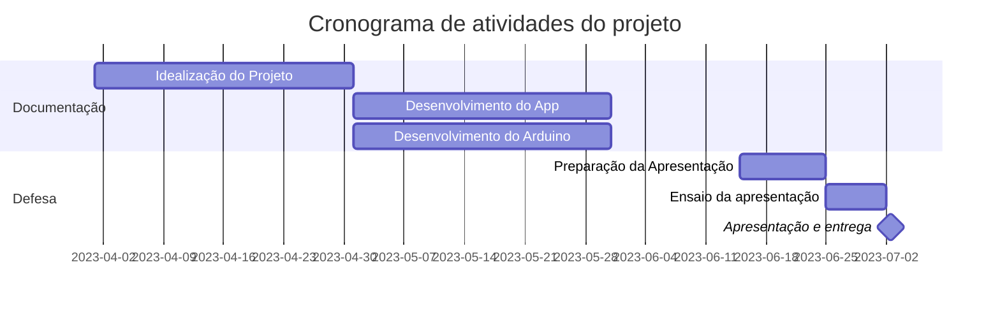

# Plant-Care-Projeto-Integrador
Projeto para a disciplina de Projeto Integrador 2

#Diagrama Gantt

```mermaid
    gantt
    title Cronograma de atividades do projeto
    dateFormat  YYYY-MM-DD
    section Documentação 
    Idealização do Projeto      :a1, 2023-04-01, 30d
    Desenvolvimento do App   :a2, after a1  , 30d
    Desenvolvimento do Arduino   :a3, after a1  , 30d
    
    
    
  
    
    section Defesa
    Preparação da Apresentação :p1, 2023-06-15, 10d
    Ensaio da apresentação :p2, after p1, 7d
    Apresentação e entrega  :milestone, after p2, 1d
```
