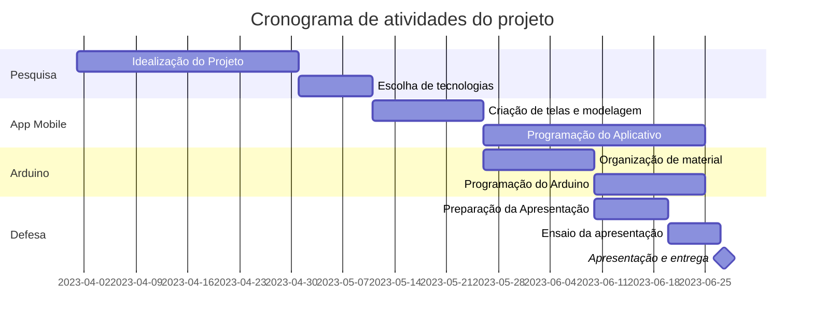

# Plant-Care-Projeto-Integrador
Projeto para a disciplina de Projeto Integrador 2

A ideia é criar um aplicativo de celular que se comunique com um sensor de umidade instalado no solo de uma planta doméstica.
O objetivo é analisar e criar uma rotina de cuidados com as plantas.

# Integração com disciplinas 

Neste projeto, está planejado fazer a integração da disciplina de desenvolvimento de dispositivos móveis, criar telas, funcionalidades juntamente com a disciplina de Internet das coisas, programando um sistema Arduino com um sensor de umidade fazendo com que esses dois serviços se comuniquem e interajam em tempo real usando tecnologias como o protocolo MQTT, Node Red e react native.

# Diagrama Gantt

